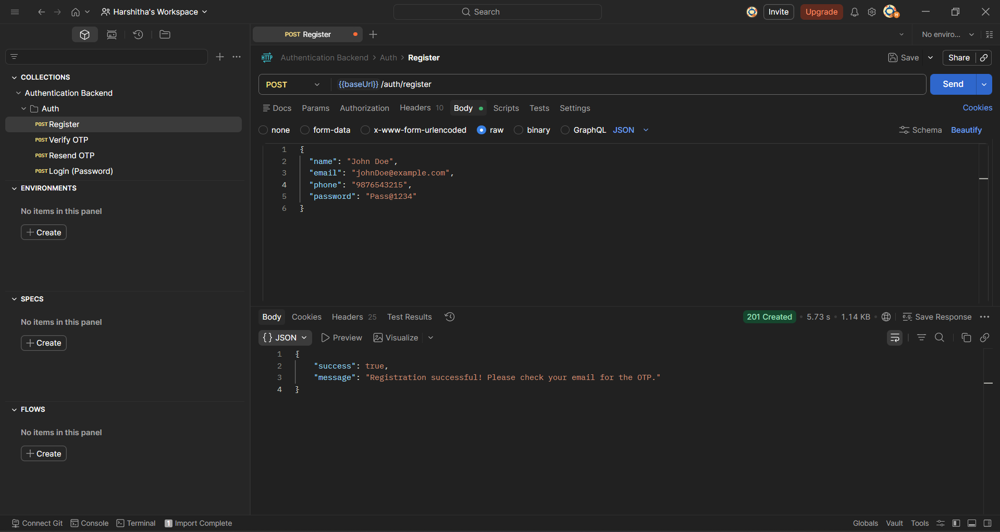
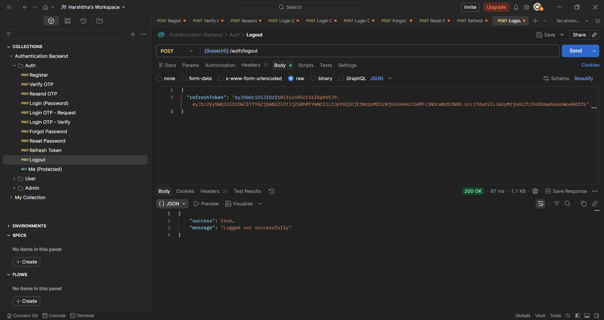
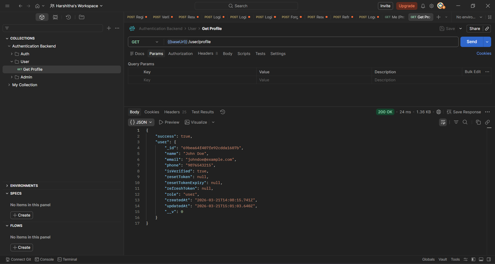

# Authentication Backend

A production-ready authentication backend built with **Node.js**, **Express**, **TypeScript**, and **MongoDB**.

---

## Tech Stack

- **Runtime**: Node.js
- **Framework**: Express.js
- **Language**: TypeScript
- **Database**: MongoDB + Mongoose
- **Authentication**: JWT (Access + Refresh Tokens)
- **Email**: Nodemailer (Gmail SMTP)
- **Security**: Helmet, CORS, express-rate-limit, bcrypt

---

## Project Structure

```
backend/
├── src/
│   ├── config/         # MongoDB connection + ENV config
│   ├── controllers/    # Route handlers (auth, user, admin)
│   ├── middlewares/    # JWT auth, role check, validation, error handler
│   ├── models/         # Mongoose User schema
│   ├── routes/         # Express routers
│   ├── types/          # TypeScript interfaces
│   ├── utils/          # OTP, token, email helpers
│   └── app.ts          # Express app entry point
├── .env                # Environment variables
├── package.json
└── tsconfig.json
```

---

## Getting Started

### 1. Install dependencies
```bash
cd backend
npm install
```

### 2. Configure environment variables
Copy the `.env` file and fill in your values:
```env
PORT=5000
CLIENT_URL=http://localhost:5173
MONGO_URI=mongodb://localhost:27017/auth_db
EMAIL_USER=your_gmail@gmail.com
EMAIL_PASS=your_gmail_app_password
OTP_EXPIRY=5
JWT_SECRET=your_strong_access_secret
JWT_REFRESH_SECRET=your_strong_refresh_secret
JWT_EXPIRES_IN=15m
JWT_REFRESH_EXPIRES_IN=7d
```

> For `EMAIL_PASS`, use a Gmail App Password:
> Google Account → Security → 2-Step Verification → App Passwords

### 3. Run the server
```bash
# Development
npm run dev

# Production
npm run build
npm start
```

---

## Environment Variables

| Variable | Description | Default |
|----------|-------------|---------|
| `PORT` | Server port | `5000` |
| `CLIENT_URL` | Frontend URL for CORS | `http://localhost:5173` |
| `MONGO_URI` | MongoDB connection string | - |
| `EMAIL_USER` | Gmail address for sending emails | - |
| `EMAIL_PASS` | Gmail App Password | - |
| `OTP_EXPIRY` | OTP expiry in minutes | `5` |
| `JWT_SECRET` | Access token secret | - |
| `JWT_REFRESH_SECRET` | Refresh token secret | - |
| `JWT_EXPIRES_IN` | Access token expiry | `15m` |
| `JWT_REFRESH_EXPIRES_IN` | Refresh token expiry | `7d` |

---

## API Endpoints

### Auth Routes — `/api/auth`

| Method | Endpoint | Auth | Description |
|--------|----------|------|-------------|
| POST | `/register` | No | Register new user |
| POST | `/verify-otp` | No | Verify registration OTP |
| POST | `/resend-otp` | No | Resend OTP |
| POST | `/login` | No | Login with email + password |
| POST | `/login-otp` | No | Request login OTP |
| POST | `/login-otp/verify` | No | Verify login OTP |
| POST | `/forgot-password` | No | Request password reset email |
| POST | `/reset-password` | No | Reset password with token |
| POST | `/refresh-token` | No | Get new access token |
| POST | `/logout` | No | Invalidate refresh token |
| GET | `/me` | ✅ JWT | Get current user profile |

### User Routes — `/api/user`

| Method | Endpoint | Auth | Description |
|--------|----------|------|-------------|
| GET | `/profile` | ✅ JWT | Get user profile |

### Admin Routes — `/api/admin`

| Method | Endpoint | Role | Description |
|--------|----------|------|-------------|
| GET | `/users` | admin, super_admin | Get all users |
| DELETE | `/users/:id` | super_admin | Delete a user |
| PATCH | `/users/:id/role` | super_admin | Update user role |

---

## Security Features

- **bcrypt** — passwords hashed with salt rounds of 12
- **JWT** — access token (15m) + refresh token (7d)
- **Helmet** — secure HTTP headers
- **CORS** — restricted to frontend origin
- **Rate Limiting** — 100 req/15min globally, 10 req/15min on auth routes
- **OTP** — 6-digit, expires in 5 min, max 3 attempts, max 3 resends
- **Password Reset** — SHA-256 hashed token, expires in 15 min

---

## Database Schema

See `DATABASE_SCHEMA.md` for full schema explanation.

---

## Testing

Import `postman_collection.json` into Postman to test all endpoints.
See `API_DOCS.md` for full request/response documentation.

---

## Screenshots

### Registration


### Verify OTP


### Resend OTP


### Login (Password)
.png)

### Login OTP


### Login OTP Verify


### Forgot Password


### Reset Password


### Refresh Token


### Logout


### Auth Me


### Profile


### Get All Users


### Delete User


### Update User Role

